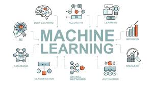
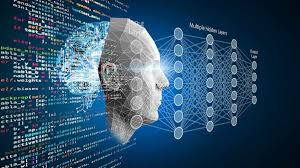
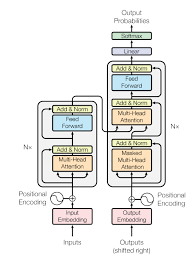

# Python , Machine Learning , Deep Learning - SGU 2025

<div align="center">

| | | | |
|:--:|:--:|:--:|:--:|
|  |  |  |  |

<br>


</div>


## 📚 Introductions

This repository contains exercises, projects, and study materials on Python and Machine Learning/Deep Learning at Saigon University (SGU) in 2025. The content ranges from fundamental Python knowledge to modern Deep Learning models.

## 📋 Main Content

### 🐍 Basic Python
- **NumPy**: Array manipulation and numerical computation
- **Pandas**: Data analysis and processing
- **Matplotlib**: Data visualization
- **OOP (Object-Oriented Programming)**: Object-oriented programming

### 🤖 Machine Learning
- **SVM (Support Vector Machine)**: Classification and regression
- **Traditional ML Algorithms**: Classical machine learning algorithms
- **Feature Engineering**: Techniques for creating and optimizing features

### 🧠 Deep Learning - Computer Vision

#### Kiến trúc CNN (Convolutional Neural Networks)
- **VGG**: VGG16, VGG19 - Deep convolutional networks
- **ResNet**: Residual Networks - Networks with skip connections
- **ViT (Vision Transformer)**: Transformer-based architecture for images
- **CLIP**: Contrastive Language-Image Pre-training

#### Object Detection
- **YOLO**: You Only Look Once – Real-time object detection
- Custom object detection applications

### 🔬 Deep Learning - Advanced

#### Sequence Models
- **Encoder-Decoder**: Architecture for sequence-to-sequence tasks
- **Transformer**: Self-attention mechanism

#### Generative Models
- **GAN (Generative Adversarial Networks)**: Generative adversarial networks
- Applications in image generation and data augmentation

#### Graph Neural Networks
- **GNN (Graph Neural Networks)**: Neural networks for graph data
- **GCN (Graph Convolutional Networks)**: Convolution on graphs

#### Unsupervised Learning
- **SOM (Self-Organizing Maps)**: Self-organizing feature maps

## 📦 Dataset cho Project Python SGU

> **Quick note:** This is the Google Drive link containing **all the datasets**. You **must download the entire folder to your computer** and then **update the file paths in the code** before running it.


---

## 🔗 Dataset

## 📦 Dataset Download
<p align="center">
  <a href="https://drive.google.com/drive/folders/1DHVwFYHhsI0_yJycMtlq0ju0qLd5JQsv?usp=sharing" target="_blank">
    
  </a>
</p>

> ⚠️ **Important:**  
> Please **download the entire Dataset folder to your computer** before using it.  
> You should not run or load data directly from Google Drive.


---
## 📁 Folder Structure (tree.txt)


```
Python project tree - 2025-11-06 09:48:46
Root: C:\Users\ADMIN\Desktop\python

├── asset
│   ├── DL.jpg
│   ├── GAN-model.pptx
│   ├── MLjpg.jpg
│   ├── python.jpg
│   └── transformer.png
├── CNN
│   ├── CNN_NhanDienMail_NhanDienAnh.ipynb
│   └── CNN_ViDuSo.ipynb
├── CODE_SVM
│   ├── [Solution]_Auto_Insurance_Prediction.ipynb
│   ├── [Solution]_Breast_Cancer_Recurrence_Classification.ipynb
│   ├── auto-insurance.csv
│   └── breast-cancer.csv
├── DecisionTree  - CNN
│   ├── cnn.ipynb
│   └── decisiontree.ipynb
├── EfficientNet
│   └── efficientnet.ipynb
├── Extended_on_Internet
│   ├── digit.png
│   ├── k_means.ipynb
│   ├── knn.ipynb
│   ├── notes.txt
│   └── svm.ipynb
├── img
│   └── dog_alaska.jpg
├── Nhập môn python
│   ├── BaiTapMonNhapMonPython.ipynb
│   ├── matplotlib.ipynb
│   ├── numpyy.ipynb
│   └── tuan3_pandas.ipynb
├── ResNet
│   ├── fine_tuned_resnet18_5cls_best.pth
│   └── resnet.ipynb
├── VGG
│   └── vgg.ipynb
├── README.md
├── requirements.txt
├── test.ipynb
└── tree.txt

(Excluded: __pycache__, venv, .venv, env, .git, .idea, .vscode, .mypy_cache, .pytest_cache, dist, build, .coverage, htmlcov)


```

## 🚀 Getting Started

### System Requirements
```bash
Python 3.8+
pip install numpy pandas matplotlib
pip install scikit-learn
pip install torch torchvision  # PyTorch
pip install tensorflow keras   # TensorFlow
pip install ultralytics        # YOLO
```

### Installation
```bash
# Clone repository
git clone https://github.com/Kietnehi/Python_2025_SGU.git
cd Python_2025_SGU

# Cài đặt dependencies
pip install -r requirements.txt
```

### Run Jupyter Notebook
```bash
jupyter notebook
```

## 📖 References

### Books & Courses
- Deep Learning - Ian Goodfellow
- Hands-On Machine Learning with Scikit-Learn, Keras & TensorFlow
- CS231n: Convolutional Neural Networks for Visual Recognition
- CS224n: Natural Language Processing with Deep Learning

### Papers
- [Attention Is All You Need](https://arxiv.org/abs/1706.03762) - Transformer
- [Deep Residual Learning](https://arxiv.org/abs/1512.03385) - ResNet
- [YOLO: Real-Time Object Detection](https://arxiv.org/abs/1506.02640)
- [Learning Transferable Visual Models](https://arxiv.org/abs/2103.00020) - CLIP
- [VGG](https://arxiv.org/abs/1409.1556) - VGG


## 👨‍💻 Author

**Kietnehi**
- GitHub: [@Kietnehi](https://github.com/Kietnehi)
- Repository: [Python_2025_SGU](https://github.com/Kietnehi/Python_2025_SGU)

## 📝 License

This project is licensed under the MIT License - see the LICENSE file for details.

## 🤝 Contributing
All contributions are welcome! Please open a Pull Request or create an Issue if you have suggestions for improvements.

---

<div align="center">
  
  **⭐ Don’t forget to star the repository if you find it helpful! ⭐**
  
  Made with ❤️ by SGU Students
  
</div>

## 🎓 **Learning Links (Canvas & Projects)**

| 🧩 **Topic** | 🔗 **Canvas / Study Material Link** |
|:--|:--|
| 🧮 **Numpy** | [View Canvas](https://drive.google.com/file/d/15mp6EOB68LNWKGEomKHZSMvcYsd4IUwr/view?usp=sharing) |
| 📊 **Matplotlib** | [View Canvas](https://www.canva.com/design/DAGZWHSgnCI/nZZyRT0o7w2OSxDM8Ys3Vw/edit) |
| 🧾 **Pandas** | [View Canvas](https://www.canva.com/design/DAGzVtrx2bc/cf3JB0ldvt2c4wEUGMFkUw/view) |
| ⚙️ **SVM (Support Vector Machine)** | [View Canvas](https://www.canva.com/design/DAGz8r2iV7M/7omI_zSA5tHtg4jRyYgMQA/edit) |
| 🔍 **KNN (K-Nearest Neighbors)** | [View Canvas](https://www.canva.com/design/DAGz-PdH2-U/1ZLbjFjGYQyIrQXhHAVDGg/edit) |
| 🌀 **KMeans Clustering** | [View Canvas](https://www.canva.com/design/DAG0AgMIdeI/nSC7YnyBhJq-lxUX4VHYwQ/edit) |
| 🧠 **CNN (Convolutional Neural Network)** | [View Canvas](https://www.canva.com/design/DAG0k1BtRMY/sSwAmH3TCnEO5oux_8C2iQ/edit) |
| 🗣️ **CNN for Text Classification (NLP)** | [View Canvas](https://www.canva.com/design/DAG0pMVsh1g/iLGh4JGtSY-XdLSzuF9Suw/edit) |
| 🧠 **RNN (Recurrent Neral Networks)** | [View Canvas](https://www.canva.com/design/DAG2kjV7FP4/Nri7P3ejwkh9iYB9SnntOw/edit) |
| 🧩 **VGG Network** | [View Canvas](https://www.canva.com/design/DAG1WmUVVAA/da9eJiuqoLMyywksKU9C_Q/edit) |
| 🎯 **YOLO (Object Detection)** | [View Canvas](https://www.canva.com/design/DAG13Fvc2Zo/YQOEeYHzBFIdm9_CjeqliA/edit) |
| 🔁 **ResNet (Residual Network)** | [View Canvas](https://www.canva.com/design/DAG2mWgdXkw/jjbjbrMHs3HSH7RTadEDMg/edit) |
| **VIT (Vision Transformer)** | [View Canvas](https://www.canva.com/design/DAG37VlY-8o/QyoyideCzExhHC1hq9JbPg/edit?ui=eyJBIjp7fX0) |
| **GCN (Graph Convolutional Networks )** | [View Canvas](https://www.canva.com/design/DAG3NBWhQVU/54tM-Rr5aF6KzNDU8y51IQ/edit) |
| **Encoder-Decoder** | [View Canvas](https://www.canva.com/design/DAG3SNePims/2qpF03qZoJR29d11VYg1pg/edit) |
| **Decision Tree** | [View Canvas](https://www.canva.com/design/DAG0p4tH3Gc/Id4V6EgIgTWgok62uCAIkw/edit?utm_content=DAG0p4tH3Gc&utm_campaign=designshare&utm_medium=link2&utm_source=sharebutton) |
| **RNN (Recurrent Neural Network)** | [View Canvas](https://www.canva.com/design/DAG2kjV7FP4/Nri7P3ejwkh9iYB9SnntOw/edit?fbclid=IwY2xjawN4z2hleHRuA2FlbQIxMABicmlkETFiOVA5TjZxWG5IR0FaNkF5c3J0YwZhcHBfaWQQMjIyMDM5MTc4ODIwMDg5MgABHgJlqoGyMQkOATqZOV0H941YliaTCdI03o381MtRCFTbsSM4UUMqmaocRd8x_aem_wkicuxCeA-39oCVUtMfCXA) |
| **EfficientNet** | [View Canvas](https://www.canva.com/design/DAG2kh8IXRI/cNZhpCeR4W0ft_sRqHGt1w/edit?ui=eyJEIjp7IlAiOnsiQiI6ZmFsc2V9fX0&fbclid=IwY2xjawN4z7JleHRuA2FlbQIxMABicmlkETFiOVA5TjZxWG5IR0FaNkF5c3J0YwZhcHBfaWQQMjIyMDM5MTc4ODIwMDg5MgABHpwGcX9lz8wJ-YS83lh0Cp0IC5Ct1X6dHsBrXRr0f0zixxlOrWhncCHV_y2k_aem_q4_TEyf3tW87hudHq5tEZg) |
| **GCN (Graph Convolutional Networks)** | [View Canvas](https://www.canva.com/design/DAG3NBWhQVU/54tM-Rr5aF6KzNDU8y51IQ/edit?fbclid=IwY2xjawN6V7JleHRuA2FlbQIxMABicmlkETFEZkNLVEJoV3VLQmtGOGRTc3J0YwZhcHBfaWQQMjIyMDM5MTc4ODIwMDg5MgABHj5gmfJ_XAqqV_J5VA_PVWt-0LHiD0AsJLiKiZoMjCseJU4VGH-ueBANwNMI_aem_HLSAfFVV8h0ochgdQKH5Xg) |
| **Transformer (Currently SOTA)** | [View Canvas](https://www.canva.com/design/DAG3EFWZHYw/FeEEms_7ZabPq_G7IfBCPw/edit?fbclid=IwY2xjawN6V9FleHRuA2FlbQIxMABicmlkETFEZkNLVEJoV3VLQmtGOGRTc3J0YwZhcHBfaWQQMjIyMDM5MTc4ODIwMDg5MgABHmTVxIjoXVwhf6qWjuYrkRzUtBo8I8MidO6KUtwrl7niU4Es32T_Pr5Xu0BS_aem_f49vEskMvHVuGYW8lJRJhQ) |


---

> 🧱 **Notes:** This list is continuosly **updated...**  
